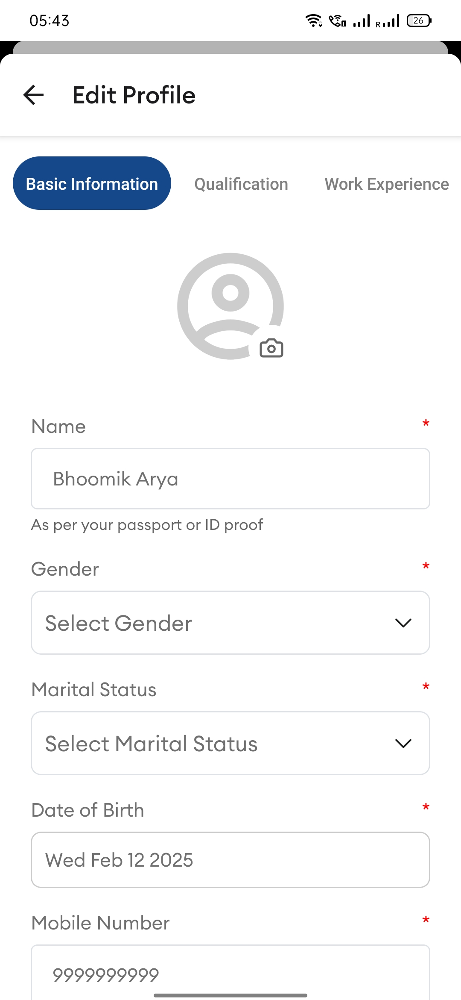
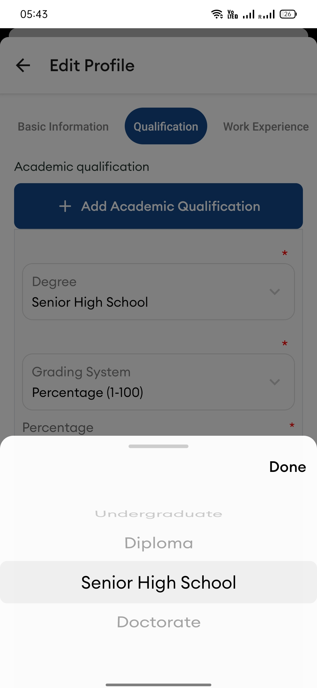
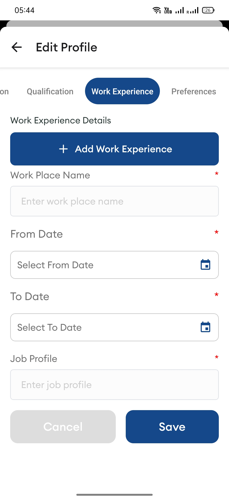

# EduVentura Mobile App

EduVentura is a mobile application designed to enhance the learning experience by providing interactive and engaging educational content. Built using TypeScript and Expo, the app ensures a seamless and performant user experience.

# Features

User authentication (Signup/Login)

Interactive learning modules

Progress tracking

Offline content support

Tech Stack

Frontend: React Native with Expo

State Management: React Context API

Installation

Prerequisites

Install Node.js

Install Expo CLI

Install dependencies using npm 

Steps

Clone the repository:

git clone https://github.com/kushmahendra/Eduventura-App.git
cd eduventura-mobile

Install dependencies:

npm install

Start the development server:

expo start

